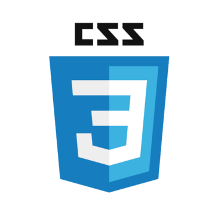
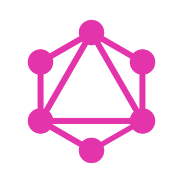
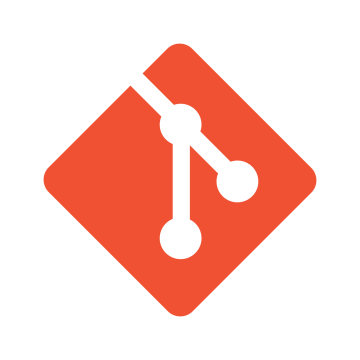
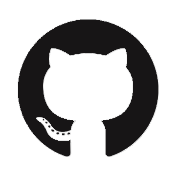

# :shinto_shrine: Carlos Aguilar :shinto_shrine:

[][www] [][mail] [][linkedin] [][twitter] [][facebook] [][itch.io] [][tumblr]

### `self-taught polymath`
### `f: coffee → code`

 

## :man_technologist: code

 

### :zap: monitor

<!--START_SECTION:activity-->
1. 🗣 Commented on [#1303](https://github.com/zyedidia/micro/issues/1303) in [zyedidia/micro](https://github.com/zyedidia/micro)
2. ❌ Closed PR [#5](https://github.com/Neko250/H4X0R.nws/pull/5) in [Neko250/H4X0R.nws](https://github.com/Neko250/H4X0R.nws)
3. ❌ Closed PR [#4](https://github.com/Neko250/H4X0R.nws/pull/4) in [Neko250/H4X0R.nws](https://github.com/Neko250/H4X0R.nws)
4. ❌ Closed PR [#5](https://github.com/Neko250/neko250.github.io/pull/5) in [Neko250/neko250.github.io](https://github.com/Neko250/neko250.github.io)
<!--END_SECTION:activity-->

 

## :headphones: sonar

[www]: https://wh0am1.dev
[mail]: mailto:carlos.aguilar.112358@gmail.com
[linkedin]: https://linkedin.com/in/carlosaguilardev
[twitter]: https://twitter.com/neko250
[facebook]: https://facebook.com/mr.carlos.aguilar
[itch.io]: https://neko250.itch.io
[tumblr]: https://shatteredcontinuum.tumblr.com
